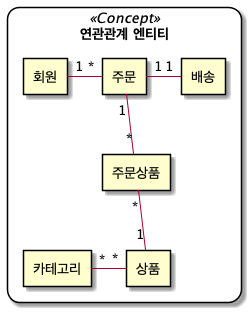
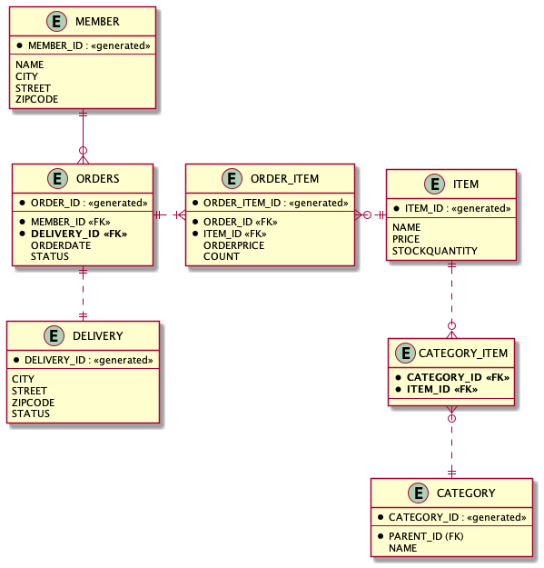
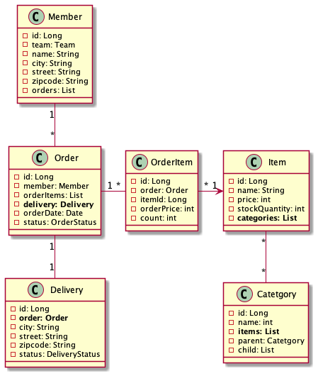

# 스프링 JPA 프로그래밍 

## 1. 요구사항 분석

- 회원은 상품을 주문할 수 있다.
- 주문 시 여러 종류의 상품을 선택할 수 있다.

---

### 1.1 기능

1. 회원 기능
 - 회원 등록
 - 회원 조회

2. 상품 기능
 - 상품 등록
 - 상품 수정
 - 상품 조회

3. 주문 기능
 - 상품 주문
 - 주문 내역 조회
 - 주문 취소

---
### 1.2 도메인 모델

 - 회원 1 -- * 주문
 - 주문 1 - * 주문상품
 - 주문상품 * - 1 상품

---
### 1.3 테이블 설계

1. 회원
- 이름, 주소정보(도시,지번, 우편번호)
2. 주문
- 회원을 외래키로 가짐
- 주문날짜, 주문상태 (주문,취소)
3. 주문상품
- 주문과 주문상품을 외래키로가짐
- 주문금액, 수문수량
4. 상품
- 이름, 가격, 재고수량

## 2. UML 작성

### 2.1 기본엔티티

### 2.2 ERD

### 2.3 상세엔티티(클래스)

